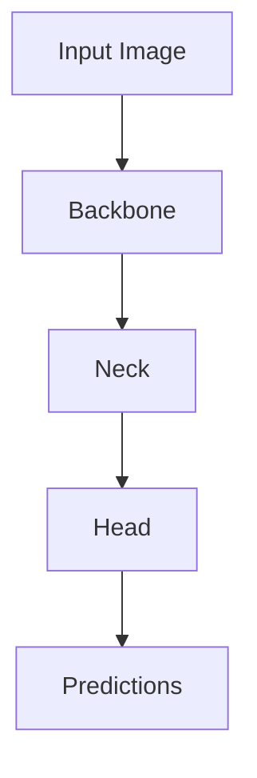
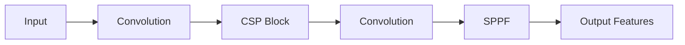
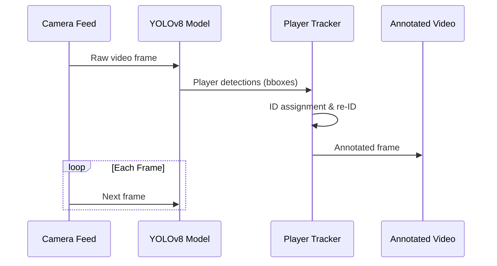

# ⚽ Player Re-Identification in a Single Video Feed 🎥

This project performs player re-identification in a football match video using object detection and consistent ID tracking techniques. It uses a YOLO model for player detection and applies multi-object tracking to assign consistent IDs as players leave and re-enter the frame.

---
## YOLO Architecture Overview
Developed by Ultralytics. This architecture builds upon previous versions with significant improvements in speed, accuracy, and flexibility, making it ideal for player detection in sports analytics.

### Key Components
1. Backbone: Enhanced CSPDarknet
- Cross Stage Partial (CSP) architecture for efficient computation

- SPPF (Spatial Pyramid Pooling Fast) for multi-scale feature extraction

- SiLU activation functions (Sigmoid Linear Unit)

***Improved gradient flow for deeper networks***

### Key Improvements in YOLOv8 for Player Detection
1. Anchor-Free Detection
- Predicts center of players directly

- Better handles overlapping players

- Simplified training process

2. Mosaic Augmentation
Combines 4 training images into one

- Improves detection of small players

- Enhances model robustness to occlusions

3. Optimized Loss Function
CIoU Loss (Complete IoU)

- Better bounding box regression

- Handles aspect ratio variations

- Improved player localization accuracy

4. Dynamic Convolution
- Adaptive kernel selection

- Better feature representation

- Improved efficiency for player detection

### 🛰️ Player Tracking with DeepSORT
In this project, we use DeepSORT (Simple Online and Realtime Tracking with a Deep Association Metric) — an advanced multi-object tracking algorithm that keeps track of players across video frames by assigning consistent unique IDs.

### 🔍 How DeepSORT Works:
- Detection: First, YOLOv8 detects objects (players, referees, ball) in each frame.

- Appearance Feature Extraction: For each detected player, a deep neural network extracts a 128-dimensional appearance feature vector.

- Motion Prediction: Uses a Kalman filter to predict each object's next position based on its past motion.

- Data Association: Matches new detections with existing tracked objects using the Hungarian algorithm, based on:

- Appearance similarity (using cosine distance between feature vectors)

- Predicted position proximity

- If no match is found for a detection, a new track is initiated with a new unique ID.


## 📂 Project Structure
```
player-reidentification/
├── model/                   # YOLO model weights
│   └── yolov8s.pt           # Pretrained detection model
├── videos/                  # Input videos
│   └── match.mp4            # Sample input video
├── output/                  # Processed outputs
│   ├── annotated.mp4        # Annotated video
│   └── player_tracks.csv    # Tracking data
├── player_tracker.py        # Main tracking script
├── requirements.txt         # Dependency list
└── README.md                # Project documentation
```
---

## 📋 Features

- Detect players in a video using a YOLO model.
- Track players using consistent IDs as they move in and out of the frame.
- Re-identify players upon re-entry based on detection and tracking.
- Annotate the video feed with bounding boxes and IDs.

---

# 🛠️ Installation & Setup

### 📥 Clone the Repository

```bash
git clone https://github.com/yourusername/player-reidentification.git
cd player-reidentification
```
### 📦 Install Required Python Libraries
Install the necessary libraries listed in requirements.txt by running:
```bash
pip install -r requirements.txt
```
#### Contents of requirements.txt:
```torch
opencv-python    #for video reading, processing, and writing
numpy            # for array manipulations and numerical operations
ultralytics      # for YOLO detection
scikit-learn     #for cosine_similarity 
```
## 📁 Prepare Files
Before running the program, make sure the necessary files are correctly placed in the project directories:

### 🎥 Input Video

Place your input video file inside the videos/ directory.
``
videos/match.mp4
``

Place your YOLO model file inside the model/ directory.
``
model/yolo_model.pt
``

**⚠️ Note: The YOLO model file is large (~186 MB) and should be downloaded separately from the Ultralytics YOLO repo.**

## ▶️ Run the Program
Open your terminal or command prompt, navigate to your project’s main directory, and run:
```
python main.py
```
### 📊 Output
*The video will be displayed with bounding boxes and assigned IDs to each player.*
## 🎥 Sample Output

Here’s a preview of the player re-identification in action:


*Consistent IDs will be maintained even as players leave and re-enter the frame.*

#### 📌 Notes
Ensure Python 3.8 or later is installed on your system. Download it from: ``https://www.python.org/downloads/``

**Adjust main.py to modify detection thresholds or customize tracking behavior.**
